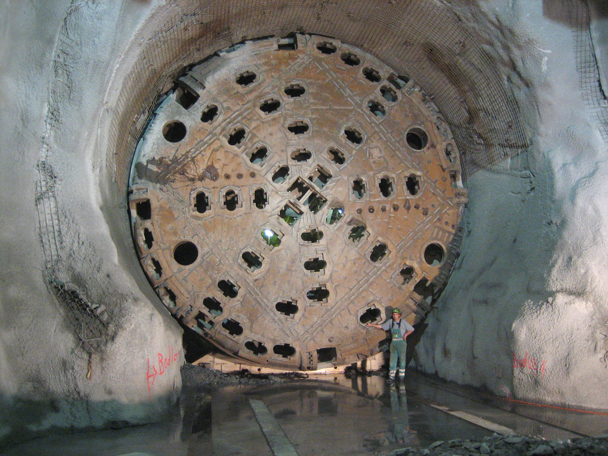

## The Data

A tunnel boring company  uses X-rays in an attempt to know rock density, ideally this will allow them to switch out boring heads on their equipment before having to mine through the rock!

They have given us some lab test results of signal strength returned in nHz to their sensors for various rock density types tested. The dataset has an almost sine wave like relationship, where signal strength oscillates based off the density, the researchers are unsure why this is.
